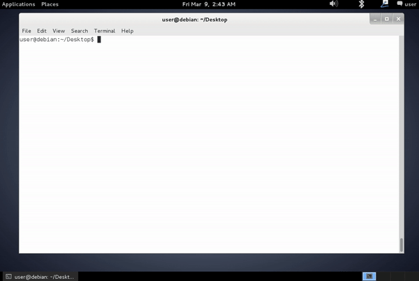

# kernelpop

kernelpop is a framework for performing automated kernel vulnerability enumeration and exploitation 
on the following operating systems:

- [x] Linux

- [x] Mac

It is designed to be `python` version-agnostic, meaning that it should work with both `python2` and `python3` 

* please let me know if you find that it doesn't

---

### example of enumeration to root (Linux)



---

### ways to use

* run from project source

```
$ git clone https://github.com/spencerdodd/kernelpop
$ cd kernelpop
$ python kernelpop.py || python3 kernelpop.py
```

* build binary

```
$ git clone https://github.com/spencerdodd/kernelpop
$ cd kernelpop
$ ./create_executable.sh
$ ./kernelpop
```

* steps to build binary without script

1. install `pyinstaller` (steps vary per build system)
2. `$ pyinstaller kernelpop.py --onefile`
3. `$ cp dist/kernelpop .`

both of the binary build steps should create a binary `kernelpop` in the project root.

---

### enumeration output

```
user@debian:~/Desktop/kernelpop$ python3 kernelpop.py

##########################
#  welcome to kernelpop  #
#                        #
# let's pop some kernels #
##########################

[*] grabbing distro version and release from underlying OS (linuxdebian7)
[*] grabbing kernel version from 'uname -a'
[+] kernel (Linux debian 3.2.0-4-686-pae #1 SMP Debian 3.2.41-2 i686 GNU/Linux) identified as:
[base]
	type:			linux
	distro:			linuxdebian7
	version:		3.2.0-4
	architecture:		i686
[specific]
	type:			linux
	distro:			linuxdebian7
	version:		3.2.41-2
	architecture:		i686
[*] matching kernel to known exploits
[+] discovered 11 possible exploits !
	[[ distro kernel matched exploit available ]]
		CVE20165195_32	Dirty COW race condition root priv esc for 32 bit
	[[ distro kernel version vulnerable ]]
		CVE20144699	Exploitable race condition in linux before 3.15.4
		CVE20143153	`futex_requeue` vulnerability before 3.14.6 allows for priv esc
		CVE20162384	Double free vulnerability in the `snd_usbmidi_create` (requires physical proximity)
		CVE20140196	`n_tty_write` vuln before 3.14.4 allows priv esc to root
		CVE20132094_semtex	perf_swevent_init Local root exploit (32 bit)
		CVE20176074	`dccp_rcv_state_process` in net/dccp/input.c mishandles structs and can lead to local root
		CVE20132094_32	perf_swevent_init Local root exploit (32 bit)
	[[ base linux kernel vulnerable ]]
		CVE20144014	`chmod` restriction bypass allows users to get root before 3.14.8
		CVE20177308	`packet_set_ring` in net/packet/af_packet.c can gain privileges via crafted system calls.
		CVE20171000112	ip_ufo_append_data() memory corruption flaw can be exploited to gain root privileges.
```

In the output, there are a few categories. This is what each means

**[[ distro kernel matched exploit available ]]**

* there is a distro version specific matched kernel exploit in the project that you can use to exploit the kernel.
High likelihood of successful exploitation.

**[[ distro kernel version vulnerable ]]**

* the distro kernel version is vulnerable to the vulnerability listed, but was not explicitly stated as tested in the
PoC exploit in the project. Exploitation without modification of the exploit may work, but has a lower likelihood of
success.

**[[ base linux kernel vulnerable ]]**

* it is unknown if the distro kernel version is vulnerable to the vulnerability, but the base linux kernel is in the
vulnerable range for the exploit. Exploitation without modification of the exploit is either unlikely or unknown,
but may still work.

---

### requirements

* `python2` or `python3`

* `pyinstaller` (if you want to build a binary)

---

# usage

```
run modes:
	(default)	        python3 kernelpop.py
	(exploit-mode)	        python3 kernelpop.py -e {exploit name}
		(dump-source)   python3 kernelpop.py -e {exploit name} -d
	(uname-mode)            python3 kernelpop.py -u {uname -a output}
	(interactive-mode)      python3 kernelpop.py -i # LEGACY option (same as uname-mode)
other:
	(playground path)       -p {new path}
	(json output file)      --digest json
```

### default mode (passive)

The `default` mode processes information about the host kernel and compares it to the known kernel exploits available
to the program. It then outputs a list of potentially useful vulnerabilities and attached exploits.

### exploit mode (active)

```
-e {exploit name}
```

The `exploit` mode dynamically compiles and runs the exploit source code with stdio interactions inside the program.
It can catch interrupts from short-stopped attempts as well. Use the name of the exploit that comes up in the
initial `kernelpop` enumeration run in `default` mode.

* **dump-source (option) `-d`**

	* This is a modifier for `exploit` mode. It dumps the source-files for the given exploit to their respective
	files in `PLAYGROUND_PATH` (default `/tmp`). This is useful for modifying exploit source on a box or working
	with exploits that require manual interaction or hard-coding of values. It is especially useful when running
	from a binary, because you won't have access to the project source code (i.e. exploit source).

### uname mode (passive)

```
-u {uname -a output}
```

This option allows you to pass the output of a `uname -a` command to the program inline, which makes it use-able for
integration into automated scripts or for any other forseeable reason. Replacement for `interactive mode`.

### interactive mode (passive) [LEGACY - required for Mac by `uname` output]

```
-i {uname -a output}
```

The `interactive` mode allows you to perform enumeration with just the output of a `uname -a` command,
which makes it useful as a host-side only enumeration tool. This run by starting `kernelpop` and with the `-i` flag
and then passing the output of `uname -a` when requested. This is a legacy feature and replaced by `uname mode`, but remains
supported as `-u` does not support Mac enumeration.

### `PLAYGROUND` path

```
-p {new PLAYGROUND_PATH dir}
```

The `-p` option sets the value of the global variable `PLAYGROUND_PATH`. This is the location where all exploit source
files are written to, and exploits compiled to. This is set, by default, to `/tmp`. However, you can set it to any
directory with this modifier in case you do not have write access in `/tmp`.

### digestible ouput

```
--digest json
```

This option allows you to dump the results of a kernelpop run to a digestible json file for later processing. So
far, I have just implemented the `json` dump, but I will work on an XML version if it is requested.

### To Do

- [ ] add more exploits! (src/to_add if anyone wants to get cracking on a few of these, be my guest!)

- [ ] include patch levels in vulnerable window comparisons

- [ ] add way to override detected settings in case of incorrect parsing or adversarial settings

### Process for adding kernel vulnerability windows: [ should write a scraper ]

* google: CVE-XXXX-XXXX "ubuntu"

	* click the canonical link (https://people.canonical.com/~ubuntu-security/cve/2016/CVE-XXXX-XXXX.html)

		* click all linked advisories at usn.ubuntu.com and parse info

		* grab patch versions for filling in vulnerability windows per version

* google: CVE-XXXX-XXXX "debian"

	* security-tracker.debian.org link (https://security-tracker.debian.org/tracker/CVE-XXXX-XXXX)

		* pull information from the bottom of the page that relates to the patched versions for the specific cve

* google: CVE-XXXX-XXXX "mitre"

	* links to other distros to pull info from

---

### currently supported CVE's:

* `CVE-2017-1000379`

* `CVE-2017-1000373`

* `CVE-2017-1000372`

* `CVE-2017-1000371`

* `CVE-2017-1000370`

* `CVE-2017-1000367`

* `CVE-2017-1000112`

* `CVE-2017-7308`

* `CVE-2017-6074`

* `CVE-2017-5123`

* `CVE-2016-5195`

* `CVE-2016-2384`

* `CVE-2016-0728`

* `CVE-2015-1328`

* `CVE-2014-4699`

* `CVE-2014-4014`

* `CVE-2014-3153`

* `CVE-2014-0196`

* `CVE-2014-0038`

* `CVE-2013-2094`

* `CVE-2010-4347`

* `CVE-2010-2959`

* `CVE-2009-1185`

---

### exploit sources

`https://github.com/SecWiki/linux-kernel-exploits`

`http://exploit-db.com/`

`https://github.com/lucyoa/kernel-exploits`

`https://github.com/SecWiki/windows-kernel-exploits`

### historical distro sources

Debian

* [debian releases](http://cdimage.debian.org/cdimage/archive/)

